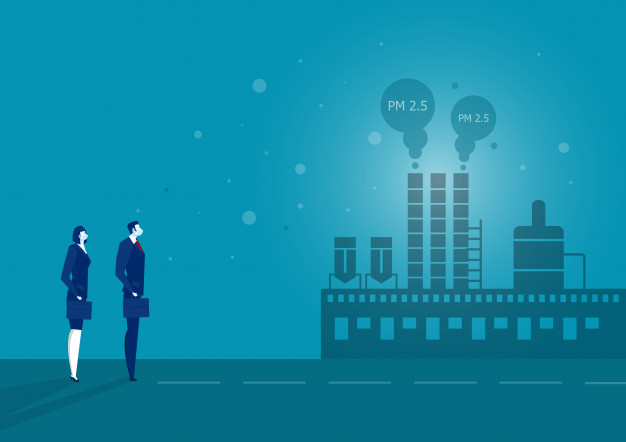

# Sistema de alerta temprana por contaminación del aire

## Equipo 8

- [Sistema de alerta temprana por contaminación del aire](#sistema-de-alerta-temprana-por-contaminación-del-aire)
  - [Equipo 8](#equipo-8)
  - [Contexto](#contexto)
  - [Procesamiento del proyecto](#procesamiento-del-proyecto)
  - [Colaboradores](#colaboradores)

***

## Contexto

En México 20 ciudades sufren de altos niveles de contaminación atmosférica [2](https://valor-compartido.com/monterrey-toluca-y-salamanca-las-ciudades-mas-contaminadas-de-mexico.), debido a esto, en 2019, la cantidad de personas que murió prematuramente en México por problemas relacionados a la calidad del aire excedió a los 48 mil habitantes Antes esta problemática, este repositorio contiene una propuesta para la creación de un sistema de alerta temprana, que pretende ser una herramienta para alertar oportunamente sobre los posibles riesgos en contaminación del aire. En este caso, nos enfocaremos en la calidad del aire asociada a las partículas suspendidas de 2.5 𝜇g ( ![PM2.5] ).

Se utilizaron datos de 2016 a 2019 de las estaciones de monitoreo atmosférico de la Zona Metropolitana del Valle de México para ajustar un modelo de machine learning que pudiera ser capaz de predecir la concentración de ![PM2.5] acorde a variables meteorológicas (temperatura, humedad relativa, velocidad del viento) y variables temporales (días julianos y día de la semana). Además, se determinó el Índice de Calidad del Aire (AQI, por sus siglas en inglés) de esta asociada a dicha concentración y que servirá como indicador para alertar a la población.

Como prototipo, se utilizó este modelo para alimentar una aplicación que permite al usuario ver el índice de calidad del aire en la ZMVM acorde a los días seleccionados.

En este repositorio se presentan todos los procedimientos aplicados desde la conformación de la base de datos, búsqueda de estimados de locacíón y variabilidad, exploración de variables categóricas, ajuste del modelo de machine learning, elaboración de gráficas  y elaboración de la aplicación.

Si deseas consultar el antecedente de estos procesos, puedes consultarlo [aquí](https://github.com/IrvingC48/BeduFase3-Proyecto_python)

***
## Procesamiento del proyecto
1. [Estimados de Locación y Variabilidad](https://github.com/IrvingC48/Prototype_BEDU/blob/main/Procesos/1_Estimados_de_locacion_y_variabilidad.ipynb)
1. [Visualización de datos: Distribuciones](https://github.com/IrvingC48/Prototype_BEDU/blob/main/Procesos/2_Distribuciones.ipynb)
1. [Base de datos](https://github.com/IrvingC48/Prototype_BEDU/blob/main/Procesos/3_ComplementoBasedeDatos.ipynb)
1. [Definición del modelo](https://github.com/IrvingC48/Prototype_BEDU/blob/main/Procesos/4_DefinicionModeloPM2_5.ipynb)
1. [Métricas y gráficos](https://github.com/IrvingC48/Prototype_BEDU/blob/main/Procesos/5_Metricas_y_graficos.ipynb)

***

## Colaboradores

- Jessica Guadalupe Tobal Cupul
- Wilber Aldair Alegria Méndez
- Irving Cisneros Castillo

[PM10]: https://latex.codecogs.com/gif.latex?\bg_white&space;PM_{10}
[PM2.5]: https://latex.codecogs.com/gif.latex?\bg_white&space;PM_{2.5}
